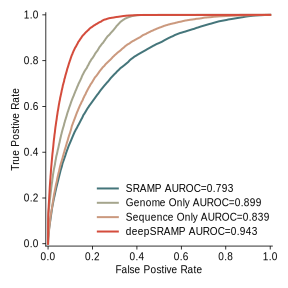
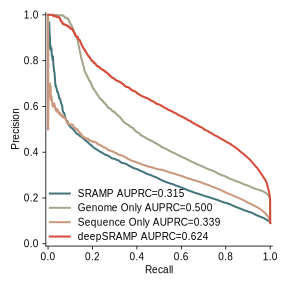

# deepSRAMP

SRAMP (http://www.cuilab.cn/sramp) is a popular mammalian m6A site predictor we previously developed (Nucleic Acids Res 2016). SRAMP has been totally cited by more than 570 papers (google scholar, 4-16, 2024) and represents the mostly used algorithm in this field. A large number of m6A sites were identified by the helps of SRAMP. After ~8 years after its development, Now we released deepSRAMP, which is designed based on a combined framework of Transformer neural network and recurrent neural network by fusing the sequence and genomic position features. The results showed that SRAMP2 greatly outperforms its predecessor SRAMP with 14.2 increase of AUC and 26.8 increase of AUPRC, and greatly outperforms other state-of-the-art m6A predictors (WHISTLE and DeepPromise) with 15.0% and 17.2 increase of AUC and 38.7% and 41.2% increase of AUPRC, respectively.

## Requirements

- torch
- pandas
- scikit-learn
- joblib
- tqdm
- matplotlib
- seaborn
- shap

## Installation

1. Install `conda` and create a virtual enviroument named `sramp` with `python` installed;
```sh
conda create -y -n sramp python 
conda activate sramp
```
2. Install `deepSRAMP` through
```sh
pip install deepsramp
```
3. Clone this repo, especially for `data` and `model` folder;
4. Download GTF and FASTA files through `sh download.sh`;

### Setup for local 

## Trained Models

Model names follow the rule of `{mode}_{half_window_size}_{target}_{extra}.model`.

|	Model Name	|	Model Mode	|	Half Window Size	|	Window Size	|	Target	|	Extra	|
| :---: | :---: | :---: | :---: | :---: | :---: |
|	**Main Models**	|
|	full_400_ythdf.model	|	Full Model	|	400	|	801	|	YTHDF1/2	|	-	|
|	full_400_mature.model	|	Full Model	|	400	|	801	|	Mature transcripts	|	-	|
|	full_400_full.model	|	Full Model	|	400	|	801	|	Full transcripts	|	-	|
|	**Other Model Examples**	|
|	seqonly_400_mature.model	|	Sequence Features Only Model	|	400	|	801	|	Mature transcripts	|	-	|
|	genomeonly_400_mature.model	|	Genome Features Only Model	|	400	|	801	|	Mature transcripts	|	-	|
|	full_100_mature.model	|	Full Model	|	100	|	201	|	Mature transcripts	|	-	|
|	full_600_mature.model	|	Full Model	|	600	|	1201	|	Mature transcripts	|	-	|
|	full_400_mature_for_time.model	|	Full Model	|	400	|	801	|	Mature transcripts	|	For training time estimation	|
|	**Single Model Examples**	|
|	full_400_a549_single.model	|	Full Model	|	400	|	801	|	A549	|	deepSRAMP$_\mathrm{single}$	|
|	full_400_a549_dp.model	|	-	|	*500*	|	*1001*	|	A549	|	DeepPromise	|
|	full_400_a549_single_random.model	|	Full Model	|	*500*	|	*1001*	|	A549	|	Selecting random transcript for training instead of max length trascript 	|


## Usage


## Citation

paper

## Tutorials

The reproduction of figures in the paper can be found in `ipynb` files.
- [Figure 1](fig1.ipynb)
- [Figure 2](fig2.ipynb)
- [Figure 3](fig3.ipynb)

## Performance

### Cross Validation



### Test on YTHDF1/2


### Test on m6Aatlas


```sh
rsync -av --exclude-from ../../deepsramp/exclude_file.txt ../../deepsramp/ .
```